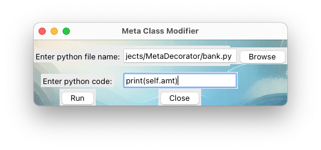

# MetaDecorator: Python Dynamic Decorator Injection 🧙‍♂️🔧

This Python script dynamically injects decorators into class methods of a given Python file, showcasing metaprogramming, regular expression parsing, and dynamic code execution.

<div style="text-align: center;">
    
</div>

### Table of Contents 📑

<!-- @import "[TOC]" {cmd="toc" depthFrom=2 depthTo=2 orderedList=false} -->

<!-- code_chunk_output -->

- [Key Features 🛠️](#key-features-️)
- [Usage 📖](#usage-)
- [Example Usage 🌟](#example-usage-)
- [Application 💡](#application-)
- [Disclaimer ⚠️](#disclaimer-️)
- [Academic Origins and Acknowledgements 🎓](#academic-origins-and-acknowledgements-)
- [License 📜](#license-)

<!-- /code_chunk_output -->

---

## Key Features 🛠️

- **Dynamic Decorator Injection**: Automatically injects decorators into class methods without altering the original method code.
- **Metaclass Utilization**: Leverages Python's metaclass mechanism to extend class functionalities.
- **Regular Expression Parsing**: Uses regular expressions to identify and manipulate class definitions within a Python file.
- **Dynamic Code Execution**: Executes user-provided Python code dynamically within the context of the program.
- **User-Friendly Interface**: Provides a simple and intuitive interface for the user to interact with the script.

---

## Usage 📖


The script prompts the user to input the name of a Python file and a snippet of Python code. It then modifies the specified file by adding a metaclass to each class, which in turn applies the provided code snippet as a decorator to all methods of these classes.

### Steps 🚶‍♂️

1. Clone the repository.
2. Run [the script](meta.py) in a Python environment.
3. Follow the on-screen prompts to specify the target Python file and the code snippet for injection.

---

## Example Usage 🌟

Two examples are included in the repository: [fruit.py](fruit.py) and [bank.py](bank.py). The user can input the name of either file to see the script in action.

<div style="display: flex; justify-content: center;">
    <div style="margin-right: 20px;">
        
    </div>
    <div>
        
    </div>
</div>

### Output 📝

<table>
<tr>
    <th colspan="2"><a href="./fruit.py">🍎 fruit.py</a> output befor and after MetaDecorator: <code>print(self.apple_color)</code></th>
</tr>
<tr>
    <td>

```bash
Example1: A basket of 4 red apples.
Example2: A basket of 50 blue apples.


```

</td>
<td>

```bash
red
blue
Example1: red
A basket of 4 red apples.
Example2: blue
A basket of 50 blue apples.
```

</td>
</tr>
    <tr>
    <th colspan="2"><a href="./bank.py">🏦 bank.py</a> output befor and after MetaDecorator: <code>print(self.amt)</code></th>
    </tr>
<tr>
<td>

```bash
Your account, Bob, has 100 dollars.


```

</td>
<td>

```bash
100
100
Your account, Bob, has 100 dollars.
```

</td>
</tr>
</table>

---

## Application 💡

This project is particularly useful for scenarios requiring dynamic analysis or modification of existing Python code, such as in debugging, profiling, or runtime analysis.

## Disclaimer ⚠️

This script modifies source files and executes code dynamically. It should be used with caution and only with files in a safe and controlled environment.

## Academic Origins and Acknowledgements 🎓

The initial version of this script was developed as part of a university course assignment for _Defensive System-Programming (20937)_ at the Open University of Israel. It earned a perfect score of 100. Since then, the code has been extensively modified and improved to enhance its functionality and applicability.

## License 📜

This project is open-source and available under the [MIT License](LICENSE).
